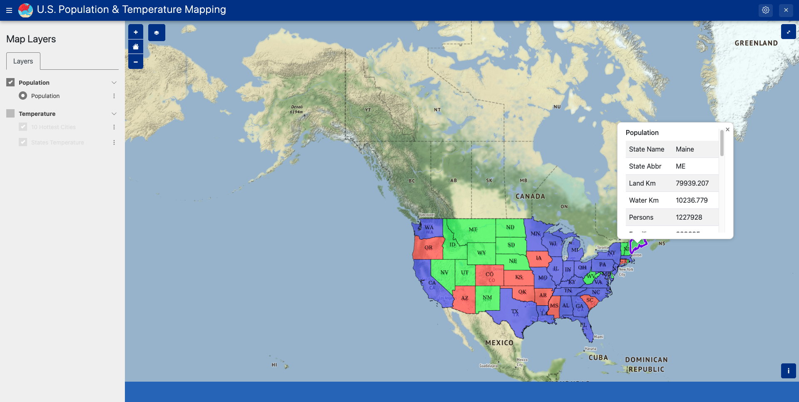

# U.S. States Temperature Mapping on Tethys

This is a web map application built on [Tethys Platform](https://www.tethysplatform.org/), showing the population and temperature of each state in the United States.

## Maps

1. WMS layer for population

   

2. GeoJSON layers for temperature

   

3. Plotting of temperature history

   

## Run it locally

1. Clone this project to your local machine:

   ```bash
   git clone https://github.com/Sonia-96/States-Temperature-Mapping-on-Tethys.git
   ```

2. Install the `tethys-platform` conda package: http://docs.tethysplatform.org/en/stable/installation.html

3. Set your GeoServer Spatial Data Service: http://docs.tethysplatform.org/en/stable/tutorials/geoserver/start_and_register.html

4. Install this app in Tethys:

   ```bash
   conda activate tethys
   cd states_temp_map
   tethys install -d
   ```

5. Run the app in Tethys:

   ```bash
   tethys manage start
   ```

6. Open `http://127.0.0.1:8000/` in your browser, you should see the Tethys portal. You can choose this app on the `Apps` page.

