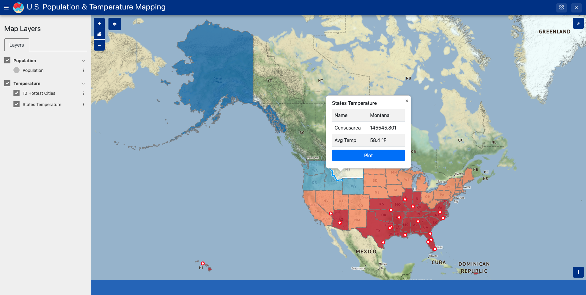

# U.S. States Temperature Mapping on Tethys

This is a web map application built on [Tethys Platform](https://www.tethysplatform.org/), showing the population and temperature of each state in the United States.

## Map Layers

1. WMS layer for population

   

2. GeoJSON layers for temperature

   

   

3. Plotting of temperature history

   

## Run it locally

1. Clone this project to your local machine:

   ```bash
   git clone https://github.com/Sonia-96/States-Temperature-Mapping-on-Tethys.git
   ```

2. Install the `tethys-platform` conda package: http://docs.tethysplatform.org/en/stable/installation.html
   - intall [Miniconda](https://docs.conda.io/en/latest/miniconda.html) or Anaconda
   - install `tethys-platform` with `conda`
      ```bash
      conda create -n tethys -c tethysplatform -c conda-forge tethys-platform
      ```

3. Set up your GeoServer Spatial Data Service. (Refer to steps 4-6 in this [guide](http://docs.tethysplatform.org/en/stable/tutorials/geoserver/start_and_register.html))

4. Install this app in Tethys:

   ```bash
   conda activate tethys
   cd states_temp_map
   tethys install -d
   ```

5. Run the app in Tethys:

   ```bash
   tethys manage start
   ```

6. Browse to http://127.0.0.1:8000/apps in a web browser and login. The default portal user is:
   - username: admin
   - password: pass

7. If all has gone well, you should see the app listed on the app library page. Click on the app tile to launch it.

## Credits

This app was developed with the help of [@swainn](https://github.com/swainn). Thank him for developing such a great platform and maintaining the [GitHub discussion board](https://github.com/tethysplatform/tethys).